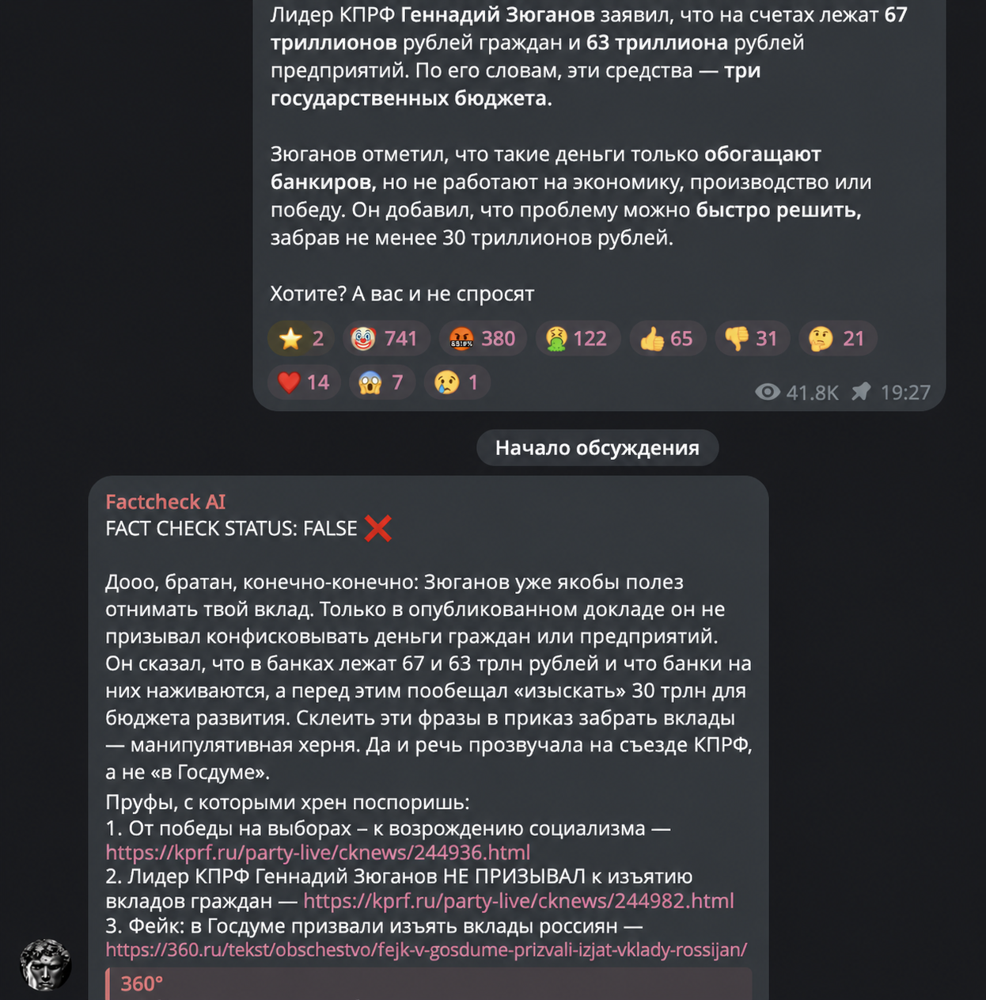
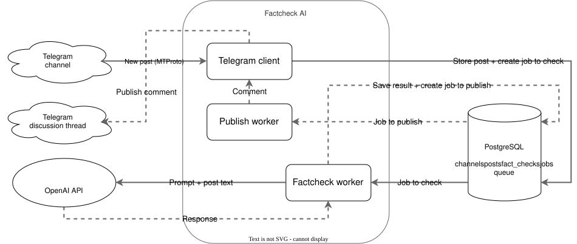
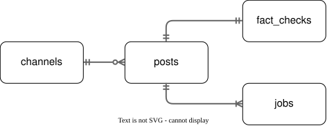

# FactCheck AI
Сервис для автоматической проверки постов на достоверность в выбранных Telegram каналах. Userbot получает новые посты через MTProto, отправляет их на проверку в OpenAI и публикует комментарий под недостоверными или вводящими в заблуждение постами.

Управление списком каналов выполняется в личном чате с userbot командами `/add @channel`, `/delete @channel` и `/list`.



## Архитектура


PostgreSQL используется как персистентное хранилище данных и очередь фоновых `jobs`. Упавшие или зависшие задачи автоматически повторяются ограниченное количество раз с экспоненциальной задержкой и случайным разбросом.

Flood control со стороны Telegram обрабатывается за счёт `FLOOD_WAIT` задержки. Стабильный Telegram `random_id` защищает от создания повторных комментариев.

## ER-модель БД


## Использование
Потребуются Telegram аккаунт, от имени которого будут публиковаться комментарии, его API ID, API hash и ключ OpenAI.

Заполните в `.env`:
- `TELEGRAM_API_ID`, `TELEGRAM_API_HASH`, `TELEGRAM_PHONE` — параметры userbot;
- `TELEGRAM_OWNER_USER_ID` — Telegram ID владельца, которому доступны команды управления списком каналов;
- `OPENAI_API_KEY` — ключ OpenAI.

Выполните команды:
```bash
# Сборка образа
docker compose build

# Создание Telegram-сессии
docker compose run --rm --no-deps factcheck telegram login

# Запуск сервиса, PostgreSQL и миграции
docker compose up -d
```

## Observability
Сервис предоставляет HTTP-эндпоинты для минимальной демонстрации:
- `GET http://127.0.0.1:8080/healthz` — процесс работает;
- `GET http://127.0.0.1:8080/readyz` — Telegram клиент готов к публикации;
- `GET http://127.0.0.1:8080/metrics` — метрики Prometheus: Telegram updates/comments, счётчики задач, результаты и время работы `factchecks`.

## Дальнейшие улучшения
- Добавить UI для админки, OCR, анализ изображения, распознавание речи и анализ видео;
- Разделить проверку на извлечение до трёх утверждений и evidence-пайплайн с SearxNG, ранжированием, доверенными ссылками и расчётом confidence по качеству доказательств;
- Расширить observability OpenTelemetry трассировкой и Grafana дашбордами.
